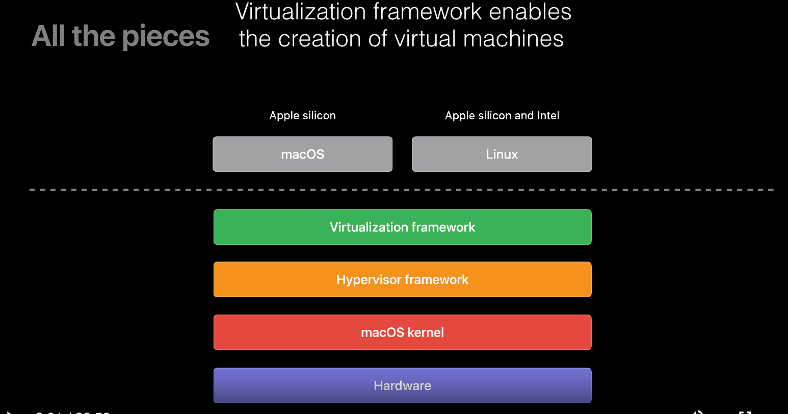

# Virtualization Framework


## 概要

資料
- https://developer.apple.com/documentation/virtualization
- [WWDC: Create macOS or Linux virtual machines](https://developer.apple.com/videos/play/wwdc2022/10002/)
- [WWDC: Create seamless experiences with Virtualization](https://developer.apple.com/videos/play/wwdc2023/10007/)

- macOS で VM を作成/操作できる高水準のAPI
  - 低水準のAPIは Hypervisor framework 
- ゲストOS は macOS, Linux が利用可能





VMを操作する CLI ツールなどは提供されていないが、Swift のコードを書けば簡単に VMの作成、起動ができる。

## macOS の VM 作成方法

https://developer.apple.com/documentation/virtualization/running_macos_in_a_virtual_machine_on_apple_silicon

に非常にわかりやすい、動作するサンプルがある。このサンプルのコードを読み込むのが一番理解が早い。

処理としては大きく

1. VM作成
2. VM起動

の２つに分かれる。

### VM作成

VM作成の手順は以下。

1. リストアイメージ ( .ipsw ) を取得
2. VMの設定 ( VZVirtualMachineConfiguration ) を作成
3. VM作成 ( VZVirtualMachine )

### リストアイメージ( .ipsw ) 取得

VM作成にはまず、リストアイメージ ( .ipsw ファイル ) が必要。

サンプルでは [`VZMacOSRestoreImage.fetchLatestSupported(completionHandler:)`](https://developer.apple.com/documentation/virtualization/vzmacosrestoreimage/3858094-fetchlatestsupported) を呼び出し最新の ipsw を取得している。

任意のOSバージョンの ipsw を取得する方法は未調査。非公式のサイトはある( https://ipsw.me/product/Mac )。


### VMの設定 ( VZVirtualMachineConfiguration ) を作成


ハードウェアモデルなどの設定作成。auxiliaryStorageは補助ストレージで、ブートローダが利用する。
```
        let macPlatformConfiguration = VZMacPlatformConfiguration()

        let auxiliaryStorage = try! VZMacAuxiliaryStorage(creatingStorageAt: auxiliaryStorageURL,
                                                          hardwareModel: macOSConfiguration.hardwareModel,
                                                          options: [])

        macPlatformConfiguration.auxiliaryStorage = auxiliaryStorage
        macPlatformConfiguration.hardwareModel = macOSConfiguration.hardwareModel
        macPlatformConfiguration.machineIdentifier = VZMacMachineIdentifier()
```

VZVirtualMachineConfigurationの作成。ディスクのサイズはここで決まる（あとから別のディスクをマウントは可能）。
メモリサイズやcpuの数も指定するが、これはVM起動時にも設定可能なのでここでの設定が意味あるかは不明。

```
        let virtualMachineConfiguration = VZVirtualMachineConfiguration()

        virtualMachineConfiguration.platform = macPlatformConfiguration
        virtualMachineConfiguration.cpuCount = cpuCount
        virtualMachineConfiguration.memorySize = meomrySize

        virtualMachineConfiguration.bootLoader = MacOSVirtualMachineConfigurationHelper.createBootLoader()
        virtualMachineConfiguration.graphicsDevices = [MacOSVirtualMachineConfigurationHelper.createGraphicsDeviceConfiguration()]
        virtualMachineConfiguration.storageDevices = [MacOSVirtualMachineConfigurationHelper.createBlockDeviceConfiguration()]
        virtualMachineConfiguration.networkDevices = [MacOSVirtualMachineConfigurationHelper.createNetworkDeviceConfiguration()]
        virtualMachineConfiguration.pointingDevices = [MacOSVirtualMachineConfigurationHelper.createPointingDeviceConfiguration()]
        virtualMachineConfiguration.keyboards = [MacOSVirtualMachineConfigurationHelper.createKeyboardConfiguration()]
```

### VM作成 ( VZVirtualMachine )

`virtualMachineConfiguration` から `VZVirtualMachine` のインスタンス作成。
`VZVirtualMachine` と リストイメージ ( ipsw ) を `VZMacOSInstaller` に与えてVMへのOSインストールが完了する。

```
    let virtualMachine = VZVirtualMachine(configuration: virtualMachineConfiguration)

    let installer = VZMacOSInstaller(virtualMachine: virtualMachine, restoringFromImageAt: restoreImageURL)

    installer.install(completionHandler: { (result: Result<Void, Error>) in
        if case let .failure(error) = result {
            fatalError(error.localizedDescription)
        } else {
            NSLog("Installation succeeded.")
         }
    })
```


## VM起動

VMの起動は以下の手順。

1. VZVirtualMachineConfiguration から VZVirtualMachine を作成
2. VZVirtualMachine.start で起動


設定作成
```
        let virtualMachineConfiguration = VZVirtualMachineConfiguration()

        virtualMachineConfiguration.platform = createMacPlaform()
        virtualMachineConfiguration.bootLoader = MacOSVirtualMachineConfigurationHelper.createBootLoader()
        virtualMachineConfiguration.cpuCount = MacOSVirtualMachineConfigurationHelper.computeCPUCount()
        virtualMachineConfiguration.memorySize = MacOSVirtualMachineConfigurationHelper.computeMemorySize()
        virtualMachineConfiguration.graphicsDevices = [MacOSVirtualMachineConfigurationHelper.createGraphicsDeviceConfiguration()]
        virtualMachineConfiguration.storageDevices = [MacOSVirtualMachineConfigurationHelper.createBlockDeviceConfiguration()]
        virtualMachineConfiguration.networkDevices = [MacOSVirtualMachineConfigurationHelper.createNetworkDeviceConfiguration()]
        virtualMachineConfiguration.pointingDevices = [MacOSVirtualMachineConfigurationHelper.createPointingDeviceConfiguration()]
        virtualMachineConfiguration.keyboards = [MacOSVirtualMachineConfigurationHelper.createKeyboardConfiguration()]
        virtualMachineConfiguration.directorySharingDevices = [ createMultipleDirectoryShareDeviceConfiguration() ]

        try! virtualMachineConfiguration.validate()

        if #available(macOS 14.0, *) {
            try! virtualMachineConfiguration.validateSaveRestoreSupport()
        }

        virtualMachine = VZVirtualMachine(configuration: virtualMachineConfiguration)
```


起動

```
        virtualMachine.start(completionHandler: { (result) in
            if case let .failure(error) = result {
                fatalError("Virtual machine failed to start with \(error)")
            }
        })
```

### ホストとゲスト間でのファイル共有

https://developer.apple.com/documentation/virtualization/shared_directories

`VZVirtioFileSystemDeviceConfiguration` を利用する。以下の例では `~/ghq`, `~/Documents` を共有している。readonlyにするかを設定可能。

```
func createMultipleDirectoryShareDeviceConfiguration() -> VZVirtioFileSystemDeviceConfiguration {
    let projectsURL = URL(fileURLWithPath: NSHomeDirectory() + "/ghq")
    let invoicesURL = URL(fileURLWithPath: NSHomeDirectory() + "/Documents")

    let sharedProjectsDirectory = VZSharedDirectory(url: projectsURL, readOnly: false)


    // It's also possible to share directories that are read-only:
    let sharedInvoicesDirectory = VZSharedDirectory(url: invoicesURL, readOnly: true)


    // Associate each shared directory with a name, which is how the framework lists them under the mount point.
    let directoriesToShare = ["MyGHQ": sharedProjectsDirectory, "MyDocuments": sharedInvoicesDirectory]
    let multipleDirectoryShare = VZMultipleDirectoryShare(directories: directoriesToShare)


    // Create the VZVirtioFileSystemDeviceConfiguration and assign it a unique tag.
    let sharingConfiguration = VZVirtioFileSystemDeviceConfiguration(tag: "share")
    sharingConfiguration.share = multipleDirectoryShare


    return sharingConfiguration
}
```

設定に追加。
```
        virtualMachineConfiguration.directorySharingDevices = [ createMultipleDirectoryShareDeviceConfiguration() ]
```

ゲストOS側で以下のコマンド実行が一度必要。
```
mount_virtiofs <tag> <directory>
```

## オペレーション

### 生成されるファイル

サンプルを実行すると以下のファイルが生成される。
```
% ls -l ~/VM.bundle
.rw-------  33M tahori 20 Dec  1:22 AuxiliaryStorage

AuxiliaryStorage — The auxiliary storage for macOS.
ゲストOSの boot loader で利用される 補助ストレージ（auxiliary storage）。
VMのバックアップを行う際はディスクイメージとともにこの補助ストレージも必要になる。

.rw------- 137G tahori 20 Dec  1:40 Disk.img
VMのディスクイメージ。このファイルのサイズがVMのディスクサイズになる。

.rw-r--r--  150 tahori 19 Dec 17:38 HardwareModel
ハードウェア情報（plist のバイナリ )

.rw-r--r--   68 tahori 19 Dec 17:38 MachineIdentifier
The Mac machine identifier.（plist のバイナリ )

.rw-------  14G tahori 19 Dec 17:38 RestoreImage.ipsw
ダウンロードした ipsw

.rw------- 1.5G tahori 19 Dec 20:32 SaveFile.vzvmsave
Sonoma からサポートされているVMの resume 用のファイル。

```

MachineIdentifierの plist の内容
```
   1   │ <?xml version="1.0" encoding="UTF-8"?>
   2   │ <!DOCTYPE plist PUBLIC "-//Apple//DTD PLIST 1.0//EN" "http://www.apple.com/DTDs/PropertyList-1.0.dtd">
   3   │ <plist version="1.0">
   4   │ <dict>
   5   │     <key>ECID</key>
   6   │     <integer>13061332575042855156</integer>
   7   │ </dict>
   8   │ </plist>
```

HardwareModel の plist の内容
```
   1   │ <?xml version="1.0" encoding="UTF-8"?>
   2   │ <!DOCTYPE plist PUBLIC "-//Apple//DTD PLIST 1.0//EN" "http://www.apple.com/DTDs/PropertyList-1.0.dtd">
   3   │ <plist version="1.0">
   4   │ <dict>
   5   │     <key>DataRepresentationVersion</key>
   6   │     <integer>1</integer>
   7   │     <key>MinimumSupportedOS</key>
   8   │     <array>
   9   │         <integer>13</integer>
  10   │         <integer>0</integer>
  11   │         <integer>0</integer>
  12   │     </array>
  13   │     <key>PlatformVersion</key>
  14   │     <integer>2</integer>
  15   │ </dict>
  16   │ </plist>
```


### ゲストOSのカスタマイズ

起動後に GUI で操作できるのでそこで適宜カスタマイズ。Disk.img ( AuxiliaryStorageも？）をコピーすればそれを再利用できるはず。


### ホストからゲストOS上でコマンドを実行

いくつか方法はあるが、一番楽なのは、ゲストOS上でリモートログインを有効にし、ssh 接続する方法。

一度手動で ssh を有効にすればあとはssh接続でセットアップの処理などを行える。


- ディスクサイズ


- CPUのコア数
- メモリサイズ
- ディスプレイサイズ
  - Sonoma からディスプレイのサイズが可変になるので、Sonoma 上では重要ではない
- ファイル共有
  - ファイル共有、

## Sonoma からの新機能

- resizable display
  - GUI 上でディスプレイのリサイズが可能
- Disk block device
  - I/O performance improvements
- Saving and restoring virtual machines
  - メモリの
- Paravirtualized GPU security isoration
- Mac keyboard
- Network block device
- Rosetta2 caching
- USB 3.0 mass storage device
- NVMe controller device


## 不明点

### ビルドで利用する際に、クリーンな環境を毎回用意する方法

ビルドで利用する際は、毎回新規にVMを起動し、ビルドの実行によって行われた変更はクリアする必要がある。これを行う効率的な方法が不明。

毎回 Disk.img をコピーすれば良いが、サイズが大きいファイルのコピーが毎回必要になってしまう。

### ゲストOSに割り当てる、IP/Macアドレスは何を指定するか


## パフォーマンス
